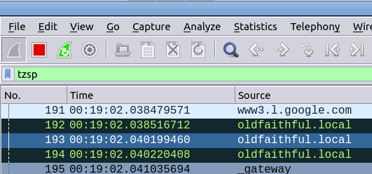

# Scrach'n'Sniff - Simple Remote Packet Sniffer / Mirror

## What it Does

Scratch'n'Sniff is a very simple remote packet sniffer, that aims to avoid the start tcpdump, capture required info, transfer with SFTP, view in Wireshark, grind.

It captures packets matching the defined packet filters (standard [TCPDump filters](https://www.tcpdump.org/manpages/pcap-filter.7.html)), then encapsulates the data into TZSP and forwards / mirrors it to a remote host, which can then view the data live with Wireshark.

## Usage

The required parameters are:

The **interface** to capture on (ie wlan0, eth0, enp0s25, etc) - This is the interface we will capture the traffic from. Usage of all interfaces (aka 'any') is not currently supported.

The **dstip** (Destination IP) to send the matching packets to, this is the remote machine you're running Wireshark or similar on.

Optional parameter are:

The **packetfilter** which is the [TCPDump Filter](https://www.tcpdump.org/manpages/pcap-filter.7.html) formatted filter to be applied to incoming traffic, that if matched, will see it forwarded. If this is not set then all traffic on the interface is captured.

The **dstport** (Destination Port) to send the TZSP encapsulated traffic to on the remote host (defaults to 37008.)

You can stop the capture with **Control + C** to exit.

On the remote machine, start Wireshark, and filter by 'tzsp' and you'll see all the remote traffic being mirrored. 



There's a good chance that you'll also see a lot of icmp errors, so suggest using the filter 'tzsp and not icmp' in Wireshark.

## Example Usage

*Capture all traffic on port 5060 on interface enp0s25 and send it to 10.0.1.252*
<br />
```python3 scratchnsniff.py --dstip 10.0.1.252 --packetfilter 'port 5060' --interface enp0s25```

Capture all sctp and icmp traffic on interface lo and send it to 10.98.1.2: 
<br />
```python3 scratchnsniff.py --dstip 10.98.1.2 --packetfilter 'sctp or icmp' --interface lo```

## Installation

Clone the repo and install the requirements:

```
git clone https://github.com/nickvsnetworking/Scratch-n-Sniff
pip3 install -r requirements.txt
```

You can now call the program with ```python3 scratchnsniff.py``` and your arguments.